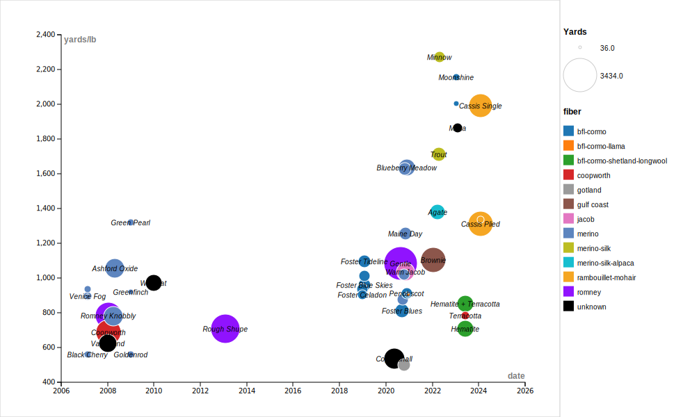

---
layout: page
title: Log
permalink: /log/
    

This is a visualization of my total yarn production data using a bubble chart from RawGraphs.io. The vertical axis represents <a href="https://woolery.com/yarn-weights-helpful-explanation/">yards per pound</a> (a measure of how fine the yarn is), the horizontal axis represents time, the size of each dot reflects the total yardage for each batch of yarn, the color of the dot represents the different types of fiber, and the name of the yarn provided as a label. For context, a commercial lace-weight yarn is typically in the range of 3000–4000 yards per pound; a commercial worsted yarn (suitable for knitting a medium sweater) is in the range of 800 yards per pound.

This table shows a log of my yarn production. The columns are sortable (just click on the heading and then on the little sort triangle).

<table class="sortable" width="100%">
	<thead>
		<tr class="log">
			<td width="30%">Name and breed</td>
			<td width="10%">Weight (g)</td>
			<td width="10%">Yards</td>
			<td width="10%">Gauge (<a href="https://woolery.com/yarn-weights-helpful-explanation/">ypp</a>)</td>
			<td width="30%">Image</td>
			<td width="10%">Date completed</td>
		</tr>
	</thead>
	<tbody>
  
    <tr class="log">
    <td class="txt"><strong>{{ image.title}}</strong> {{ image.desc}}</td>
    <td class="num">{{ image.weight}}</td>
    <td class="num">{{ image.yards}}</td>
    <td class="num">{{ image.gauge}}</td>
    <td></td>
    <td class="date">{{ image.date}}</td>
    </tr>
  
  
  	</tbody>
</table>