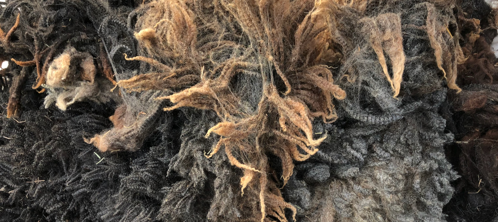

The remarkable thing about wool is that all wool comes from a specific sheep, and every sheep is different. Not only do different breeds have remarkably varied characteristics—the length and fineness of the fiber, the amount of crimp, the color, the amount and type of grease—but each individual sheep has its own fleece personality. The age and health of the sheep matters a lot: lambs' wool is finer, and stress (from disease or lambing) can weaken the fleece and cause points of breakage. But the sheep's wool also expresses the mysterious complexities of its genetics: perhaps a distant ancestor had some characteristic of fuzziness or fineness or color which, though not expressed in the intermediate generations, comes through in subtle variations. 

This is especially true of sheep that are crosses of different breeds, where their recent parentage contributes all sorts of potential wild variability into the mix. I get most of my fleece from a kind neighbor who started her flock with a ram and two ewes. The ram's main breed characteristics, to look at him, were consistent with his longwool heritage: his fleece is silky, long, fine, more like ringlets than like fuzz. The two ewes are both crosses of Blue-faced Leicester (another longwool breed) and Cormo (itself a cross between Corriedale and Merino), and their wool is fine, soft, crimpy, full of rich lanolin. All three are creamy white. But their lambs tell a more complicated story! Two of their offspring are brown-black—a surprise until I learned that one of the ram's parents was a Shetland, a breed that comes in all sorts of colors. And color aside, the lambs vary widely in the texture of their wool: some expressing more of the longwool side of their parents' heritage, some with the crimpier and finer Merino characteristics, and some with a dual coat (longer, coarser hairs combined with a soft downy undercoat) that owes something to the Shetland side of the family. As the flock grew over several years, each generation of lambs was a new surprise.
{:height="100px"}

Now I have about 12-16 of these fleeces from several seasons of shearing and am thinking about how to handle them as I take them through the fiber preparation process. I've given them all an initial rinse to get out the worst of the dirt, but they still need a thorough scouring to remove the excess lanolin. I've done that myself in the past but it's hard: it requires very hot water and a lot of rinsing. For one or two fleeces, it's fine, but it doesn't scale up very well. Once they're washed, I want to card them and turn them into roving, where the fibers are smoothed and made easier to spin into a soft, consistent yarn. As with the washing, I've done this myself on a small-to-medium scale, but for this many fleeces it prompts me to ask myself whether how I really want to spend my time is on fiber preparation or on spinning and weaving.

The economics of having someone else do these things for me are interesting. There are spinneries that will wash and process wool for you: some of them are very small and are willing to handle very small jobs, while others operate at more of an industrial scale and are able to tackle, say, creating a new line of yarn for a large shepherding concern. And in both cases, the cost of the work is directly related to the level of attention and individualized activity you ask for: if you want to blend fibers together in a specific ratio, or give special care to an exquisite fleece, you'll pay for the additional human effort that represents. Paying someone else for work I could do myself reminds me what my own effort is worth and also gives me a metric for translating it into other kinds of goods: in addition to getting the fleece washed and carded, I could get it spun into yarn for me—or I could use that money to buy yarn from a store, and knit it into a sweater—or I could buy a sweater...

Many things change as I entrust more of that workflow to others, but the one I'm interested in here is how much the raw materials retain of their individual character as they pass through it. Yarn made from Merino wool is profoundly different from yarn made from a longwool. You can wear Merino next to the skin; it's used for fine suiting and soft sweaters, but it's not hard-wearing or tough. Longwool breeds tend to be a bit coarser, silkier, longer, good for use as warp threads or outerwear, lustrous and strong. Yarn manufacturers often mix different types of wool together to get a combination of their virtues. Until recently, most yarn labeling just said "wool"—but with the rise of interest in terroir and single-origin products, you can now buy yarn that declares its origins more clearly through the evocative names of sheep breeds, familiar and unfamiliar: Shetland, Blue-faced Leicester, Gotland, California Variegated Mutant, Jacob, Wensleydale. Programs like the Livestock Conservancy's [Shave 'Em to Save 'Em](https://livestockconservancy.org/get-involved/shave-em-to-save-em/) focus on making the rarest and most endangered breeds better known, by enlisting hand-spinners in trying out their wool and experiencing first-hand the distinctive qualities of each breed, the kinds of yarn it can be used to make. Like heirloom apple varieties, these breeds carry valuable genetic diversity but also remind us of all the different ways things can be wonderful. An apple that tastes like strawberries; an apple good for making apple dumplings; an apple that will keep in the cellar over the winter; a dessert apple. A fleece that spins up to resemble something like Elvish chain mail.

Planning out how to use these new fleeces, I stared at the heaps of wool: the two white ewes, the white ram, the white lambs, the brown-black lambs. I could just group them by color and get an enormous batch of uniform white roving and another of black-brown: about 25 pounds of wool, enough to make a big project like a set of matching blankets. I could even have the whole lot carded together to make a heathered grey-brown yarn that would probably be very lovely: a Leicester Longwool/Shetland-Cormo/BFL melange with strength and luster and softness. Looking at the ram fleece—his name is William Wallace—I was struck by how his longwool genes set him apart, the locks of wool somehow silkier and more lustrous, a pearly gray, different from the ewes and lambs. If I kept that one fleece separate, I could spin it quite differently to bring out the luster and drape. Could I pull that one out and ask the spinnery to handle it separately? Already, they had taken 8 months to process the first fleece I sent them, largely because it was such a tiny order: they have to clean the carding machine after each order, so they wait to fit in my one little fleece when it won't cause a delay. Maybe including William Wallace in the mix with Edna and Lucy and the others would make the whole batch better, like adding a little cornmeal to a batch of bread, or a little rye to the whiskey. And if I have to wash and card his fleece myself, the way fiber is piling up in my workroom, I may never get to it. 

One of the lamb fleeces is brown-black, faded towards the tips to grey and gold, but with a few patches that are silvery with an especially curly texture. Turning the wool as it dried on the lawn in the sun, I pulled out these parts and set them aside—I couldn't bear the idea of just mixing them in with the rest of the fleece in the carding process. Taking the single-source idea to an extreme, like the winemakers who select individual grapes by hand, this little handful of fiber, no more than a few ounces, feels precious and distinctive enough to be worth the effort of attention—but also, being so small, it fits into my own scope of effort. I can wash it and card it in a couple of afternoons, and spin it into a skein of yarn that can become a hat or a pair of mittens or the yoke of a sweater, or a narrow stripe on an enormous brown and white blanket, to remind me of all the different strands that are mixed into its apparent uniformity.