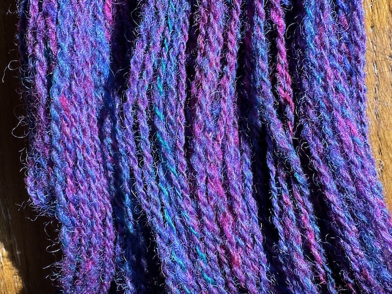
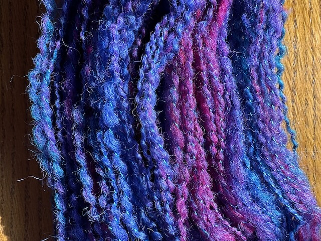
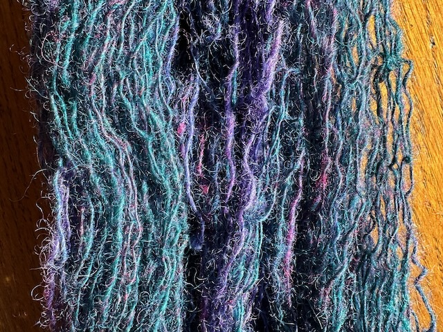

Several months ago I was given a large bale of brightly colored fiber for spinning. In fiber-technical terms it was "roving" which means that the fiber had been carded (in this case by machine) and then drawn out into a long, soft, somewhat disorganized strand about 2 inches wide, ready for spinning. The wool was supposedly a mix of Rambouillet (90%) and mohair (10%) and had been dyed several different colors (magenta, purple, various blues, some teal) which had been roughly mixed together in the carding process, but not fully blended, and the ratios of the colors varied a lot; some of the roving was mostly blue and purple while some was a more even mix with big patches of magenta. There was about two and a half pounds in all. 

It's rare (for me at least!) to have this much dyed roving. To put this in perspective, a typical sweater or small blanket might weigh a pound or two. It was tempting to spin it all the same way, but this was also an unusual opportunity to try several different approaches while still ending up with a substantial amount of each type of yarn.

{:height="100px"}

The first approach I tried was a standard 2-ply yarn: I spun two fairly fine strands and then plied them together to make a stronger yarn. As the photo above shows, each strand contains many different colors mixed together, and the plied result thus contains even more color variety: the yarn looks speckled and the colors average out to some extent over the length of the skein. The brightness of the magenta is still there, but muted by the other colors, and the blues are almost indistinguishable. I like this yarn a lot and it's strong and usable for a wide range of projects: a sweater, a blanket, a (somewhat scratchy) scarf, a pillow. I measured this yarn at about 1300 yards per pound on average, which is equivalent to a light worsted weight commercial yarn—something you might use for an everyday sweater. 

{:height="100px"}

As I was spinning the yarn, I really found myself enjoying the flow of colors and the way they met and blended together to create subtle effects, and I felt that these qualities were being lost in the plying process, which tends to visually average the colors in the two plies. As an experiment I decided to try a plying technique that would make a single color sequence more visible. Thread-plying is an approach in which instead of using two plies of the spun yarn, you use a fine thread for one of the plies. The thread can be a neutral color or a color that complements the main fiber. I used a slightly variegated rayon thread in the same jewel-toned blue that appeared in the wool, and I deliberately spun the wool in a thick-and-thin style so that bumps of the wool would be prominently visible in the finished yarn. The thread is glossy and provides an almost sparkling quality. The yarn has a lot more character and the individual colors are much more visible, especially up close. This will be a more challenging yarn to use, since it's somewhat weaker and more prone to wear and pilling than the standard 2-ply version—it's more of an "art yarn" that calls attention to itself and its construction.

{:height="100px"}

Although I had assumed that a single strand of unplied yarn would be too weak to be useful, in the course of making the thread-plied yarn I discovered that this fiber actually made a fairly strong single. In my final experiment, I decided to explore that path more fully, and I spun several skeins of singles yarn. This was ultimately my favorite version of the fiber: it brought out the pure colors in their most vibrant form, and the smoother texture of the yarn was more visually peaceful than either of the other versions. In finishing the yarn, I agitated it fairly energetically in hot water to full the fiber slightly so that it would hold together better. This yarn is fairly fine, probably closer to a light sock weight (about 2000 yards per pound). Because it's unplied, it won't hold up in a project with specific abrasion points like a sweater, but it could be used in a scarf or a woven blanket. 

Each of these three versions brings out a different quality in the original fiber