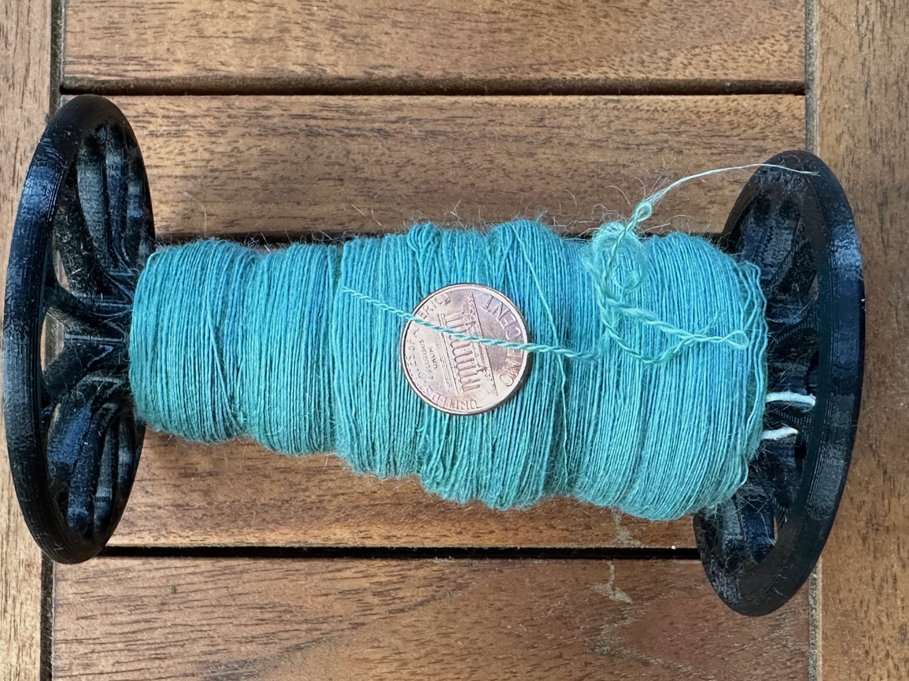

After a long time as a spinner admiring very fine yarn and pushing myself to spin finer and finer, I finally reached the point this year where I am able to spin at a fine, consistent gauge. 

Looking back at the records for my spinning output over the years, I can see that my early efforts are typically in the range of 900 to 500 yards per pound: according to the Woolery's [yarn weights chart](https://woolery.com/yarn-weights-helpful-explanation/), that corresponds to a range from worsted to super bulky: good, sturdy yarns for making heavy items. One complicating factor here is that beginning spinners (myself included!) often spin very dense yarn, so the measurement of yards per pound doesn't tell the whole story. My early yarns were thick but also heavy, so the "super bulky" yarn I made was probably not as thick as a commercial yarn of the same weight. The measurement of "wraps per inch" is a useful complement to the "yards per pound" metric, since it tells me the rough diameter of the yarn. Taken together, these two measurements indicate whether the yarn is dense and thick (rope!), dense and thin (twine!), fluffy and thick (yarn for a blanket), or fluffy and thin (yarn for a sweater or shawl).

Over time, I can see a steady trend in both of these qualities: although I didn't measure the wraps per inch systematically at first, I can picture those early yarns and they were thick and lumpy. The early yarns I did measure were in the range of 9–12 wraps per inch; a few years later, I see the values rising so that I'm routinely spinning in the range of 18-20 wpi (which the yarn chart considers to be "super fine" or lace weight). And the ypp measurement similarly gets finer and finer. One of my most recent yarns was a 2-ply yarn spun at almost 2300 yards per pound, which is characterized as "super fine" in the Woolery yarn chart. 

{:height="100px"}

In this narrative, spinning finer yarn feels like "progress" and a steady gain in expertise, and in a sense it is. My ability to spin a finer yarn arises from several related skills in relation to what is happening physically as the yarn is being formed. The fiber in my hand has no twist and can pull apart, and the pulling action of the wheel draws it steadily through my fingers, which control how much fiber is being drawn forward and hence how thin the yarn will be. Just past my fingertips the fiber is caught by the twist coming from the rotation of the wheel, which stabilizes the fiber as "yarn" and prevents it from drifting apart. Once the twist enters the fiber, the thickness of the yarn is set. The balance between the pull and the twist, in that crucial inch, is what determines how thick the yarn will be but also how consistent. My hands control that balance through both perception and fine motor coordination at my fingertips that senses how the fiber is flowing and twisting, and can respond instantly to regulate that relationship. When I remember my early experience of spinning, I can feel how I always felt I was responding after the fact, spasmodically, overcompensating too late for something that had already gone too far, vacillating between slubby lumps and thin bits. 

It's a common joke among spinners that once you learn to spin fine, it's hard to go back to spinning thick, and also hard to go back to spinning unevenly (for instance, to create a thick-and-thin slubby art yarn). I don't think this is true, but it directs our attention to what learning a physical skill entails: turning inadvertencies into deliberate actions that can be repeated and modulated. As a beginner I overbalanced between thick and thin because I couldn't sense or control how the fiber was flowing; as I gain competence, the feedback loop between my fingers and my brain is more lively and more under my control. It's not that I can spin finer: it's that I can spin more intentionally.

{:height="100px"}
